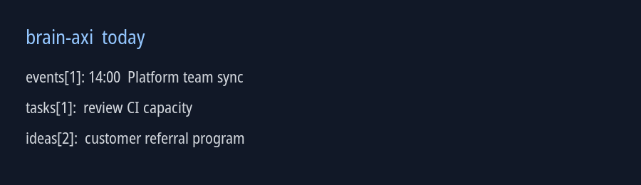

# secondbrain

A local, file-backed second brain with an agent-facing CLI: `brain-axi`.

Markdown in `vault/` is the only source of truth. The CLI is deterministic, makes no network calls,
and leaves natural-language interpretation to the agent driving it.



## Install

### Release binary

```sh
curl -fsSL https://raw.githubusercontent.com/Thanhbinh1905/secondbrain/main/install.sh | sh
```

The installer downloads the latest release, verifies `checksums.txt`, runs `--version`, and only
then replaces the installed binary. It installs under `~/.brain-axi/bin` and links into the first
usable directory on `PATH`. Set `BRAIN_AXI_INSTALL_DIR` or `BRAIN_AXI_LINK_DIR` to override them.

### Go or checkout

```sh
go install github.com/Thanhbinh1905/secondbrain/cmd/brain-axi@latest

git clone https://github.com/Thanhbinh1905/secondbrain.git
cd secondbrain
./install.sh --checkout
```

Checkout installs record their method and can fast-forward themselves with `brain-axi update`.
The supported development toolchain is Go 1.22 or newer.

## Create a vault

```sh
brain-axi init
brain-axi setup skill --pi
brain-axi doctor
```

Run `init` from the directory where you want `vault/` created. Use `--path` for another location
and `--timezone Europe/Lisbon` when the host timezone cannot be determined. `init` creates the
vault's git repository but never commits your notes.

Vault discovery order is `--vault`, `$BRAIN_AXI_VAULT`, a vault above the current directory, then
`~/vault` and `~/secondbrain/vault`. If both home candidates exist, the command refuses and asks
you to choose. A malformed record is reported with its path and line; it is never skipped.

## Capture

The agent resolves natural-language dates. The CLI receives absolute values:

```sh
brain-axi add event "Platform team sync" \
  --when 2026-09-04T14:00 --duration 60m --with platform-team
brain-axi add idea "customer referral program"
brain-axi add task "migrate the staging database" \
  --assignee platform-team --follow-up-after 14d
brain-axi add note "ask infrastructure about CI capacity"
```

For a whole meeting, the agent proposes records, asks for confirmation, writes a YAML batch, and
runs `brain-axi add --batch meeting.yml`. The batch validates every entry before writing any file.

## Ask the brain

```sh
brain-axi today                 # today's events and due tasks
brain-axi week                  # this week's events and tasks
brain-axi ideas --status pending
brain-axi tasks
brain-axi due                    # delegated, imminent, and dormant items
brain-axi brief                  # compact triage view
brain-axi search "capacity"
brain-axi show <id>
brain-axi related <id>
brain-axi agenda <person>
```

Every command accepts `--json`. Human-facing board and review output is framed only on a TTY, so
piped output stays stable and machine-readable.

## Links and delivery tracking

Records can link to one another, people, pull requests, and external work ids:

```sh
brain-axi link migrate-staging-db https://github.com/owner/repo/pull/12
brain-axi link fleet migrate-staging-db --task PROJ-42
brain-axi pr --refresh
brain-axi ship calendar-export \
  --pr https://github.com/owner/repo/pull/14 \
  --merged-at 2026-09-04T15:40:00+07:00
```

Forge access is delegated to explicitly invoked `gh` or `glab`; ordinary reads never contact a
forge. Cached pull-request status is stored in that record's frontmatter and always includes its
read time. The fleet bridge is local and one-way.

## Board and recap

```sh
brain-axi board
brain-axi board --html ~/secondbrain/board.html
brain-axi recap month
brain-axi recap quarter --html ~/secondbrain/recap.html
brain-axi export ics --out brain.ics
```

Board and recap HTML pages are self-contained files rendered from versioned payloads and committed
templates. Their panes and empty states are fixed, validation happens before replacement, and neither
page writes to the vault. `--open` delegates opening to the configured local command.

Recap counts outcomes, not activity. Values the vault cannot reconstruct are `unknown`, not zero;
comparisons use only the same vault's previous equivalent period.

## Vault layout

```text
vault/
  .brain/config.yml   timezone, week start, and review windows
  events/             dated commitments
  ideas/              half-formed ideas
  tasks/              commitments to check
  notes/              standalone notes
  people/             people and derived agendas
  daily/              daily notes
```

All records are Markdown with YAML frontmatter. `links:`, `raise_with:`, `fleet_tasks:`, and
forge fields remain visible and hand-editable. Recurrence is stored as `rrule:` plus exceptions and
expanded only while answering a query. There is no database, cache, or index.

Concurrent writers are not coordinated by a lock. For scripted or multi-process writes, serialize
commands at the caller; a malformed or partially written Markdown file fails loudly on the next
read. See [docs/design.md](docs/design.md) for the format, time rules, and architecture.

## Development

```sh
gofmt -l .
go vet ./...
go test ./...
go test -race ./...
golangci-lint run
```

CI runs formatting, vet, build, the full test suite, the race detector, and `golangci-lint`.
Golden files define both machine output and terminal presentation. Read the diff before using `-update`.

Release automation is triggered by pushing a `v*` tag. It builds Linux and macOS binaries for amd64
and arm64, publishes checksums, and attaches them to the GitHub release. Checksum signing is a
follow-up consideration; the current trust boundary is HTTPS plus SHA-256 verification.

The detailed contributor design is in [docs/design.md](docs/design.md), requirements are in
[docs/requirements.md](docs/requirements.md), and user-story coverage is in
[docs/user-stories.md](docs/user-stories.md). Project signals and naming remain intentionally
small: the command is `brain-axi`, the repository is `secondbrain`, and the first release should
establish those names before adding badges or broader documentation structure.

## License

MIT. See [LICENSE](LICENSE).
